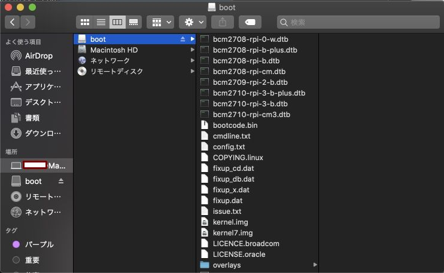

# Lightning Shield control file

## About

For headless setup, you can put some control file(empty file with specific name) to microSD card.

### Place

FAT partition.  

Windows  

Mac  

### control file

#### `RPI_APMODE`

Set as AP mode and reboot (same [SW2 long press](setup_faq.md#how-to-use-panel-buttons))

#### `RPI_CLIENT`

Set as CLIENT mode and reboot

#### `RPI_USEWEB`

Start WEB server in Raspberry Pi.

#### `RPI_MAINNET`

Start ptarmigan as Bitcoin mainnet. If this file not found, start as Bitcoin testnet.
