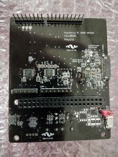
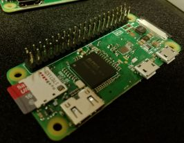
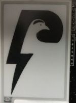
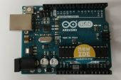
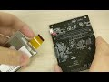
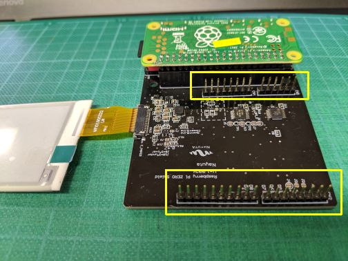
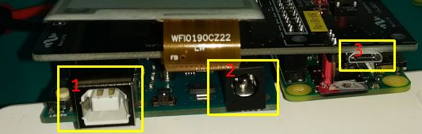
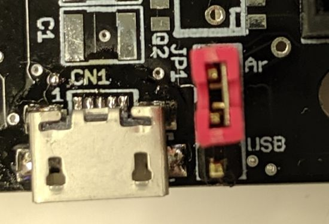
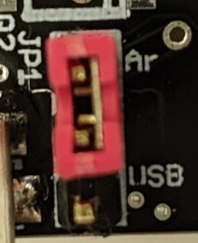
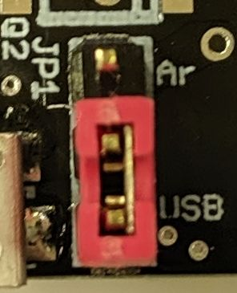

# [Setup](../README.md)> Board

## items

Lightning Shield for Arduino

Raspberry Pi Zero W

ePaper

Arduino UNO

## ePaper

[movie](https://youtu.be/c-4CIAWcO2I)

## Arduino Pin

You need solder pins to connect Arduino.

## Power supply

There are three way power supply to Raspberry Pi.

1. USB
2. AC adapter
3. micro-B USB

### NOTE

If you supply power to micro-B USB, change Lightning Shield jumper near micro-B connector.

* from Arduino
  

* from micro-B
  separate from Arduino
  
