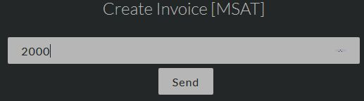
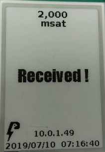

# [top](index.html)> Payment test

Let's making a payment using the Lightning Network!

* [Create an invoice](#create-an-invoice)
* [Payment](#payment)

----

## Create an invoice

1. create an invoice from WEB setting.

  
  

2. wait for displaying the QR code on the ePaper.

## Payment

1. scan QR code displayed ePaper.
2. Payment!
3. wait...
4. ePaper displays "Received!"

