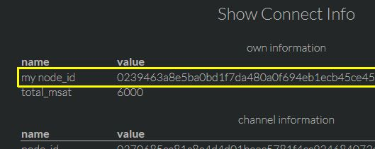
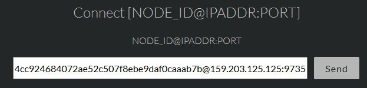
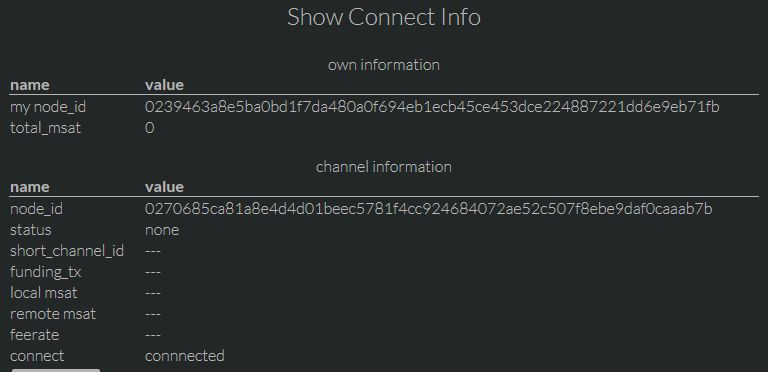
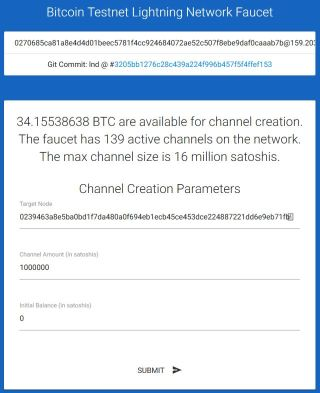
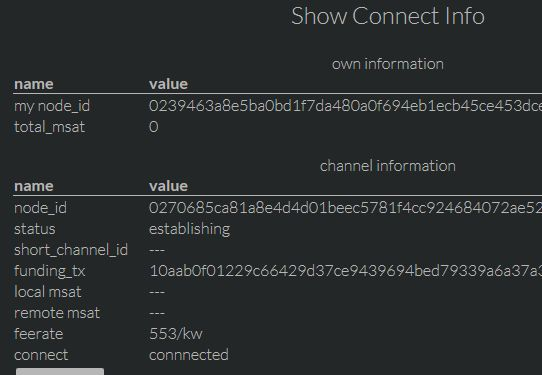
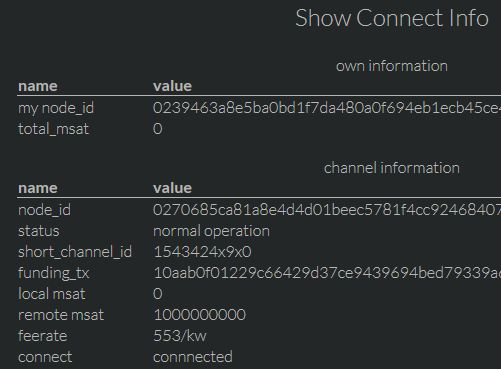

# [Setup](../README.md)> Ptarmigan

All settings are done from the browser on CLIENT mode.

## open channel from peer (testnet)

1. check my node_id
   **menu: Channel > Show Connect Info**
   

2. connect other node you want to open channel
   Maybe, Raspberry Pi don't have Global IP address. So connect from Raspberry Pi to peer node, and open channel from peer.

   1. decide peer node
      You need decide peer node.
      * your node
      * faucet service
        * Here use [Bitcoin Testnet Lightning Network Faucet](https://faucet.lightning.community/).

   2. connect to peer node
      Currently, Faucet node_id is `0270685ca81a8e4d4d01beec5781f4cc924684072ae52c507f8ebe9daf0caaab7b@159.203.125.125:9735`.
      **menu: Connect/Close > Connect [NODE_ID@IPADDR:PORT]**
      

   3. check connection status: **connected**
      **menu: Channel > Show Connect Info**
      

3. open channel from peer node
   

4. check connection status: **establishing**
   **menu: Channel > Show Connect Info**
   

5. wait some confirmation...

6. check connection status: **normal operation**
   **menu: Channel > Show Connect Info**
   

7. channel is opened !
   You can receive from Lightning Network.
