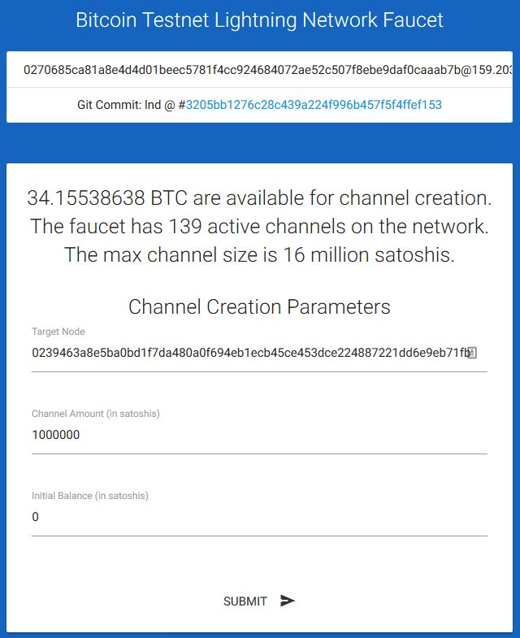

# [Setup](../README.md)> Ptarmigan

All settings are done from the browser on CLIENT mode.

## open channel from peer (testnet)

1. check my node_id
   **menu: Channel > Show Connect Info**  
   

2. connect other node you want to open channel
   Maybe, Raspberry Pi don't have Global IP address. So connect from Raspberry Pi to peer node, and open channel from peer.

   1. decide peer node
      You need decide peer node.
      * your node
      * faucet service
        * Here use [Bitcoin Testnet Lightning Network Faucet](https://faucet.lightning.community/).

   2. connect to peer node
      Currently, Faucet node_id is `0270685ca81a8e4d4d01beec5781f4cc924684072ae52c507f8ebe9daf0caaab7b@159.203.125.125:9735`.  
      **menu: Connect/Close > Connect [NODE_ID@IPADDR:PORT]**  
      

   3. check connection status: **connected**  
      **menu: Channel > Show Connect Info**  
      

3. open channel from peer node  
   

4. check connection status: **establishing**  
   **menu: Channel > Show Connect Info**  
   

5. wait some confirmation...

6. check connection status: **normal operation**  
   **menu: Channel > Show Connect Info**  
   

7. channel is opened !  
   You can receive from Lightning Network.

## open channel from [LNBIG](https://lnbig.com/#/) (mainnet)

WARN: use something Linux console.

1. change blockchain to mainnet and reboot automatically.  
   **menu: 1st Layer > Change Blockchain Network**  
   

2. start mainnet  
   

3. check my node_id  
   **menu: Channel > Show Connect Info**  

4. connect [LNBIG](https://lnbig.com/#/) and call API

   1. select "LND / C-Lightning / BTCPay / Eclair" and NEXT.  
   

   2. push COPY button on "Commands for LND"
   

   3. save text to `lnbig.txt` on your Linux console.

5. execute below to get connection string

```bash
cat lnbig.txt | sed -e 's/^lncli connect \(.*$\)/\1/g' | sed -e 's/^\(.*9735\).*/\1/g'
```

```text
ex.
   028a8e53d70bc0eb7b5660943582f10b7fd6c727a78ad819ba8d45d6a638432c49@lnd-33.LNBIG.com:9735
```

6. connect using connection string
   **menu: Connect/Close > Connect [NODE_ID@IPADDR:PORT]**  

7. If connection is OK, execute below to get call LNBIG API string.

```bash
cat lnbig.txt | sed -e 's/.*| \(.*$\)/\1/g' | sed -e "s/^\(.*private=0'\).*/\1/g"
```

```text
ex.
   curl -G --data-urlencode remoteid@- 'https://lnbig.com/api/v1/oc?k1=040aa501-3273-442c-b966-13488f85e727&private=0'
```

8. execute command from Linux console

```bash
echo -n MY_NODEID | LNBIG_API_STRING
```

```text
ex.
   echo -n 03019960f1fe3efb6dd3663606cc196e41ad31fb5535e1264a24d1a1986e7a9059 | curl -G --data-urlencode remoteid@- 'https://lnbig.com/api/v1/oc?k1=040aa501-3273-442c-b966-13488f85e727&private=0'
```

9. check LNBIG website
