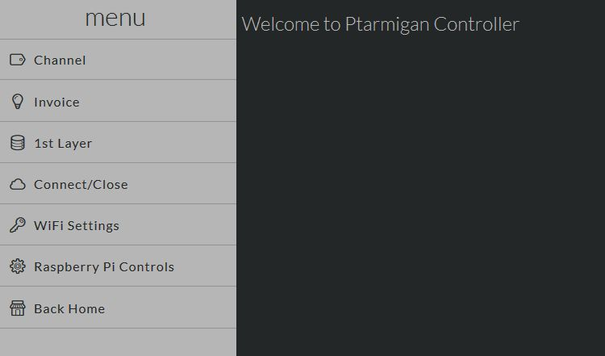
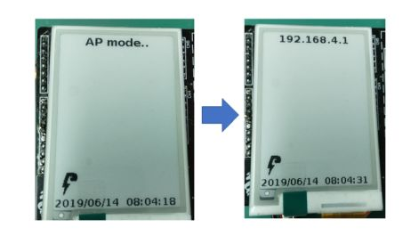
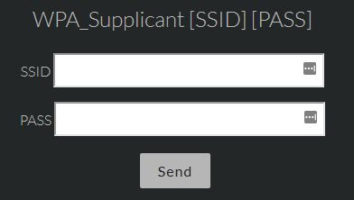
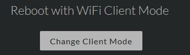
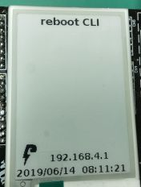
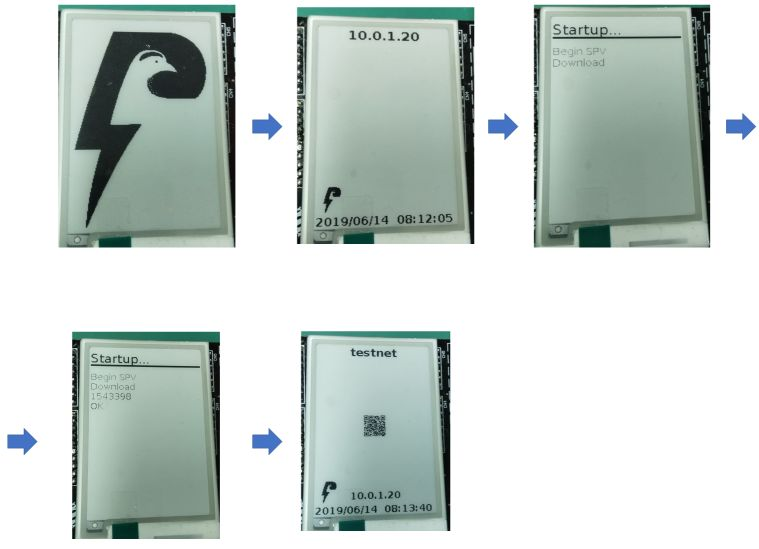
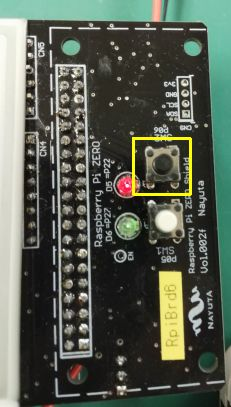

# [Setup](../README.md)> Raspberry Pi

## SD card

RaspianOS + Lightning Shield for Arduino modules

* Download SD image file
  * [v2019-06-13](https://drive.google.com/open?id=1Q_JDZZQq8In98TGOh1q48CRnRq-259wh)

* write to SD card
  * [how to write SD card image](https://www.raspberrypi.org/documentation/installation/installing-images/README.md)

### First boot settings

* AP mode
  * You need set SSID/PASS and change CLIENT mode.
* enable WEB setting
* Lightning Network: testnet mode

## Mode

There is two modes.

* AP mode
  [Raspberry Pi as an WiFi access point in a standalone network](https://www.raspberrypi.org/documentation/configuration/wireless/access-point.md).

  * SSID: `PtarmServer` / PASS: `Ptarmigan`
  * IP address: `192.168.4.1`
  * WEB setting: enable
  * Lightning Network: disable

* CLIENT mode
  Connect to WiFi router
  * IP address: DHCP
  * WEB setting: enable
  * Lightning Network: enable

## WEB setting

http://IP_ADDRESS:7000/

* Lightning Network
  * channel information
  * create/show invoices
  * connect other LN node
  * close channel
* 1st Layer(Bitcoin)
  * create receiving address
  * send all bitcoin for empty wallet
  * change mainnet/testnet (need reboot)
* WiFi
  * add SSID/PASS (need reboot)
* Mode
  * change CLIENT/AP mode (need reboot)

## WiFi setting and reboot CLIENT mode

1. start AP mode  
   

2. **menu: WiFi Settings > WPA_Supplicant [SSID] [PASS]**  
   

3. set WiFi SSID/PASS you want to connect(your home, office, ...)
   * like connect your phone to WiFi
   * (it adds `/etc/wpa_supplicant/wpa_supplicant.conf`)

4. **menu: WiFi Settings > Reboot with WiFi Client Mode**  
   

5. Raspberry Pi reboot with CLIENT mode(browser is disconnected)  
   

6. start CLIENT mode  
   

7. done !

### NOTE

* `Startup...` shows block download.
  * It takes many times and sometime restart.
* You want to change from CLIENT to AP mode, push Shield's Switch long time(above 10sec).  
   
