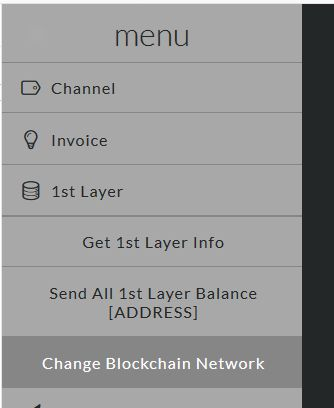
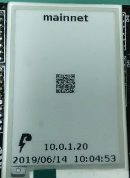
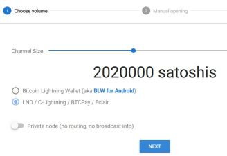
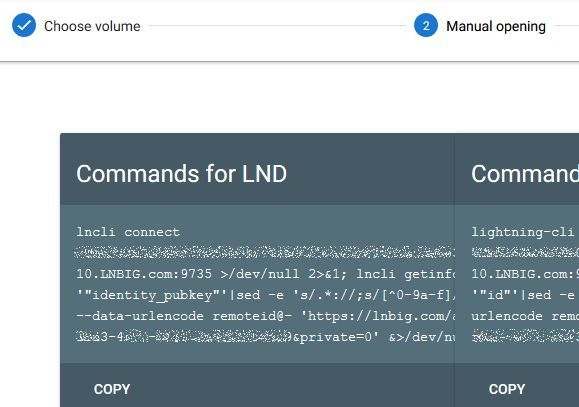

# [top](index.html)> The mainnet of Lightning Network

Lightning Shield supports both the testnet and mainnet of Bitcoin.  
If you want to use the mainnet of Lightning Network, please change the Bitcoin network to it and restart.  

* [changing the network to the mainnet](#changing-the-network-to-the-mainnet)
* [open channel from LNBIG (mainnet)](#open-channel-from-lnbig-mainnet)

----

## Changing the network to the mainnet



## Openning the channel from [LNBIG](https://lnbig.com/#/)

NOTE: Please use something Linux console.

### 1. Change the network to the mainnet and wait for an automatic reboot

**Menu: 1st Layer > Change Blockchain Network**  


### 2. Mainnet starts



### 3. Check my node_id

**Menu: Channel > Show Connect Info**

### 4. Connect to [LNBIG](https://lnbig.com/#/) and making the API call

1. Select "LND / C-Lightning / BTCPay / Eclair" and click the NEXT.  


2. click the COPY on "Commands for LND"


3. Save the text in `lnbig.txt` on your Linux console

### 5.Execute the command below in order to get the connection string

```bash
cat lnbig.txt | sed -e 's/^lncli connect \(.*$\)/\1/g' | sed -e 's/^\(.*9735\).*/\1/g'
```

```text
ex.
   028a8e53d70bc0eb7b5660943582f10b7fd6c727a78ad819ba8d45d6a638432c49@lnd-33.LNBIG.com:9735
```

### 6. Connect LNBIG using connection string

**Menu: Connect/Close > Connect [NODE_ID@IPADDR:PORT]**

### 7. If the connection is OK, execute the command below to get call the LNBIG API string.

```bash
cat lnbig.txt | sed -e 's/.*| \(.*$\)/\1/g' | sed -e "s/^\(.*private=0'\).*/\1/g"
```

```text
ex.
   curl -G --data-urlencode remoteid@- 'https://lnbig.com/api/v1/oc?k1=040aa501-3273-442c-b966-13488f85e727&private=0'
```

### 8. Execute the command from Linux console

```bash
echo -n MY_NODEID | LNBIG_API_STRING
```

```text
ex.
   echo -n 03019960f1fe3efb6dd3663606cc196e41ad31fb5535e1264a24d1a1986e7a9059 | curl -G --data-urlencode remoteid@- 'https://lnbig.com/api/v1/oc?k1=040aa501-3273-442c-b966-13488f85e727&private=0'
```

### 9. Check the LNBIG website

## Bash script for LNBIG

If you connect Raspberry Pi via SSH, copy `Commands for LND` strings to `lnbig.txt` and execute the following script.

```bash
#!/bin/sh

CONN_STR=`cat lnbig.txt | sed -e 's/^lncli connect \(.*$\)/\1/g' | sed -e 's/^\(.*9735\).*/\1/g'`
echo $CONN_STR
/home/pi/Prog/ptarmigan/install/ptarmcli --connaddr $CONN_STR


NODEID=`/home/pi/Prog/ptarmigan/install/ptarmcli -l1 | jq -r '.result.node_id'`
API=`cat lnbig.txt | sed -e 's/.*\(https.*$\)/\1/g' | sed -e "s/^\(.*\)&private.*/\1/g"`
echo -n $NODEID | curl -G --data-urlencode remoteid@- "$API&private=0"
```
