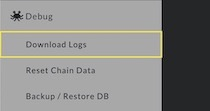
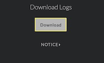
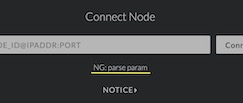
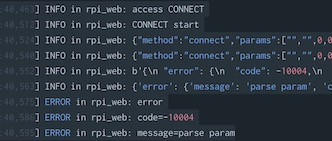

# [Index](index.html)> About System log

Lightning Shield supports downloading logs.  
If you want to find the cause of error, it would help you.

1. Download Logs  
    ⅰ. **Menu: Debug > Download Logs**  
       

    ii. Download a file(lnshield_log_'hostname'_yyyymmdd.tar.gz)  
        

2. About Contents  
    The downloaded file contains some logs.  
     * mainnet - system log of ptarmigan(mainnet)
     * testnet - system log of ptarmigan(testnet)
     * stdout - standard output of ptarmigan
     * rpiweb - web client log

3. How to find the cause  
    If you use web client and find some errors, open the log in 'rpiweb'.  
    It has normal processing('INFO') and error processing('ERROR') in web client.  
      
      
    (This log indicates failure to connect because of wrong the node ID.)

    Basically the logger process is  
    **'access' -> 'start' -> many processings... -> 'success'**  
    If any errors happen in processing, it reports 'ERROR'.

4. The logging table of menu name in web and access name in log  

    MENU NAME - ACCESS NAME
    * Lightning Network
        * Information - GETINFO
        * Channel Information - GETCHANNEL
            * mutual close - CLOSE_MUTUAL
            * force close - CLOSE_FORCE
        * Closed Channel - SHOWCLOSEDCHANNEL
        * Connect Node - CONNECT
        * Withdraw To Wallet - PAYTOWALLET
    * Invoice
        * Create Invoice - CREATEINVOICE
        * Create Invoice List - LISTINVOICE
    * Bitcoin
        * Information - GET_1STLAYER_INFO
        * Send All 1st Layer Balance - EMPTYWALLET
        * Change Blockchain Network - CHANGE_BLOCKCHAIN_NETWORK
    * Device
        * Information - DEVICEINFO
            * User - CHANGE_DIGEST
            * hostname - CHANGE_HOSTNAME
        * Reboot - REBOOT
        * Shutdown - SHUTDOWN
        * WiFi Setting - WiFi_SETTING
        * Change SSH Password - CHANGE_USERPASSWD
    * Debug
        * Download Logs - DOWNLOADLOG
        * Reset Chain Data - RESET_CHAINDATA
        * Backup / Restore DB - BACKUP/RESTORE
    * Back Home - INDEX
