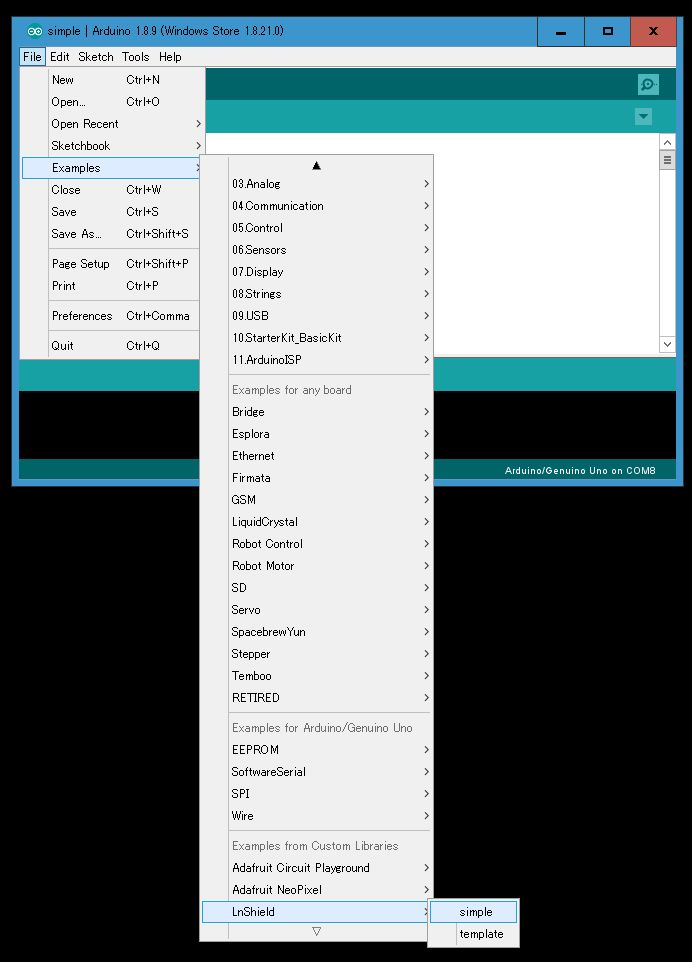

# [top](index.html)> Sample sketch

## breadboard

* LED x1: notification
* Button x1: create invoice request
* [download fritzing file](images/lnshield_sample.fzz)

## Arduino Sketch

* [sample.ino](https://github.com/nayutaco/lns_arduino_library/blob/master/examples/simple/simple.ino)

### `variables`

* `LnShield` instance

### `setUp()`

* GPIO settings
* initialize `LnShield`
* set callback functions

### `loop()`

* get button status
  * if pushed, call create invoice API.
* call `eventPoll()`
  * send and receive between Ptarmigan(ping/pong)
    * if ping/pong fail, goto ERROR status and call error callback function.
  * check internal status
    * if status change, call change status callback function.
    * Arduino can use API on `STATUS_NORMAL` status.
  * check local amount
    * if amount change, call change amount callback function.

### callback functions

* `callbackChangeStatus()`
  * something LnShield status changed without `ERROR` status.
    * `callbackError()` is called when `ERROR` status.

* `callbackChangeMsat()`
  * local amount changed.
    * First status change to `STATUS_NORMAL`, this function will be called.

* `callbackError()`
  * Library caught error(maybe fail connect to Raspberry Pi).
  * Never return user application.
    * push RESET button on Arduino
