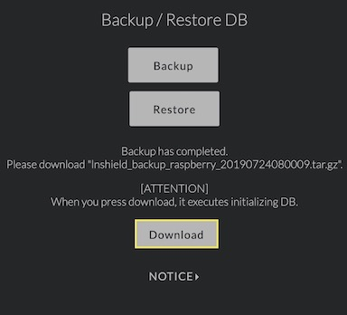
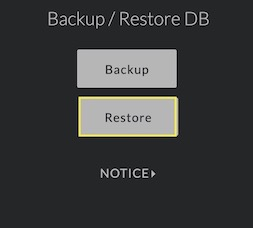
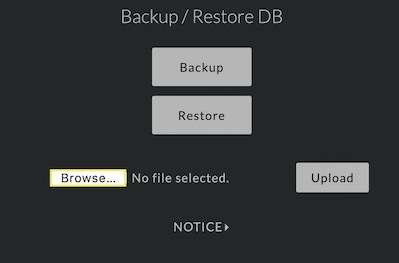
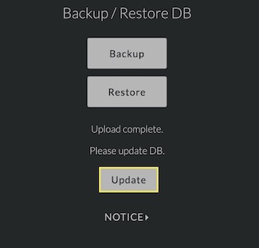

# [top](index.html)> Backup & Restore DB

## Introduction to backup & restore DB for updating SD card.

1. Backup DB (assume this step is in Client mode)
    1. **menu: Raspberry pi Controls > Backup & Restore DB**  
       
    
    2. create Backup file(yyyymmdd.tar.gz)  
       This step makes 'ptarmd' stop, so you can't keep using without reboot this device.
       

    3. download the file  
       You can download the file wherever your local.
       
    
2. Get ready for new SD card

3. Restore DB (assume this step is in AP mode as First boot)
    
    **[ATTENTION] You must use the latest backup file!**  
    
        If you don't follow below attentions, you have a risk of taken away all of your funds.  
        
            1. After downloading backup, you must not reboot the device and change balance.  
            2. After restoring DB and changing blance, you must not use same backup file to start over.  
            
    1. **menu: Raspberry pi Controls > Backup & Restore DB**  
       
    
    2. select Restore button  
       

    3. browse backup file(yyyymmdd.tar.gz)  
       This step you have to select the backup file downloaded in step 1-iii.
       

    4. upload the file  
        Confirm the name you selected is collect and click 'upload' button.
       

    5. update DB  
       Click 'update' button, this function will update DB used the uploaded file.
       

    6. confirm the process complete  
       After update, you need to reboot this with Client mode. 
       

4. Reboot with Client mode
    1. **menu: Raspberry pi Controls > Reboot with Client mode**
   
    2. confirm 'show channel info' or 'Get 1st layer info' etc.  
       You can confirm it would return to original balance or state.  
