# [Index](index.html)> Board

First of all, let's prepare to use the board.

* [Lightning Shield for Arduino](#lightning-shield-for-arduino)
* [Arduino pin](#arduino-pin)
* [ePaper](#epaper)
* [Power supply](#power-supply)  

## Lightning Shield for Arduino

### Things need to be ordered at Nayuta Lightning shop  

Board  
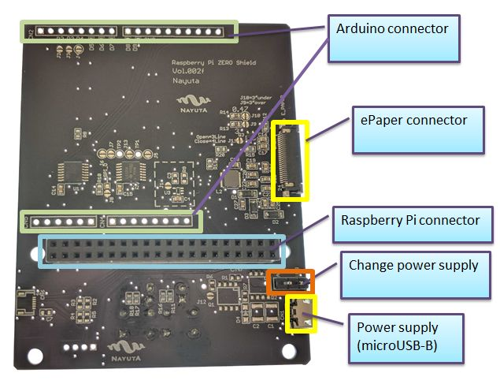

ePaper  
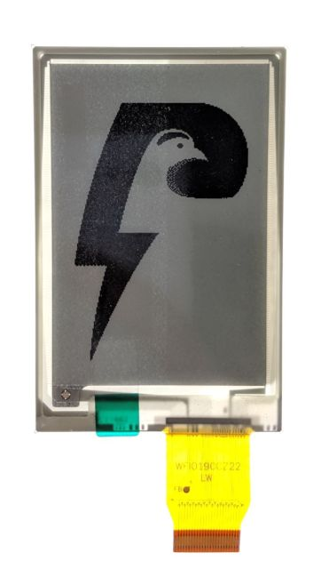

### Things need to be prepared by yourself

Raspberry Pi Zero W  
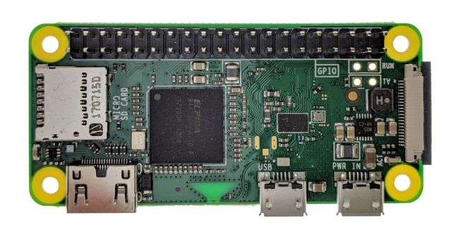

Arduino UNO  
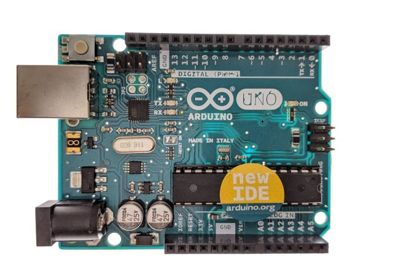

## Arduino pin

you need to solder pins to connect Arduino.  
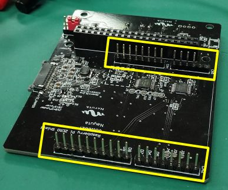

## ePaper

[Please watch the how-to-use video](https://youtu.be/c-4CIAWcO2I)  
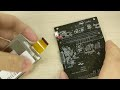  

### 1. Pull the ePaper's connectors

Pull gently...  
  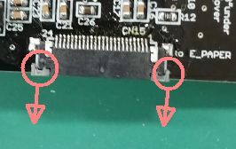

Pulled!  
  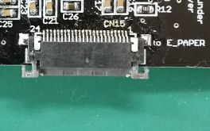

### 2. Insert the cable and push the connectors carefully...

  

Pushed!  
  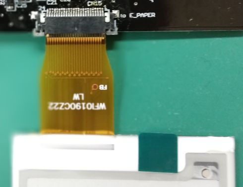

## Power supply

There are three ways to supply power to Raspberry Pi.

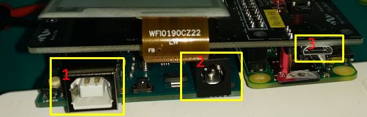

1. USB
2. AC adapter
3. micro-B USB (see [NOTE](#note))

### NOTE

If you supply power through micro-B USB, please change the Lightning Shield's jumper located near the micro-B connector.  
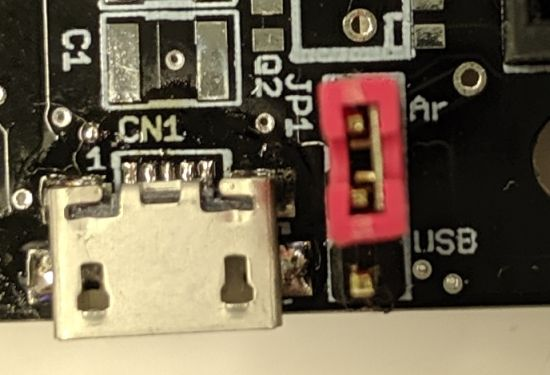

* If through Arduino  
  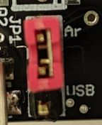

* If through micro-B  
  Separate the jumper from Aduino  
  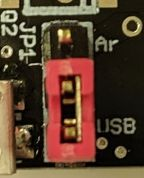

----

[Next> Raspberry Pi](setup_raspi.md)
