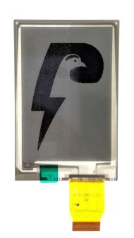
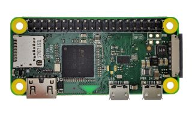
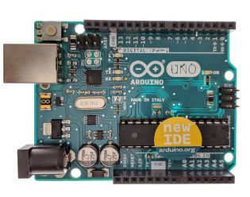

# [Index](index.html)> Board

* [Lightning Shield for Arduino](#lightning-shield-for-arduino)
* [Arduino pin](#arduino-pin)
* [ePaper](#epaper)
* [Power supply](#power-supply)  

## Lightning Shield for Arduino

Lightning Shield  

ePaper  

### Things you need to prepare by yourself

Raspberry Pi Zero W  

Arduino UNO  

----

## Arduino pin

You need to solder pins to connect Arduino.  

----

## ePaper

  
[watch the how-to-use video](https://youtu.be/c-4CIAWcO2I)

### 1. pull the ePaper's connectors

pull gently...  
  

pulled!  
  

### 2. insert the cable and push carefully...

  

pushed!  
  

----

## Power supply

There are three ways to supply power to Raspberry Pi.

1. USB
2. AC adapter
3. micro-B USB(show [NOTE](#note))

### NOTE

If you supply power through micro-B USB, please change a Lightning Shield's jumper located near micro-B connector.  

* through Arduino  
  

* through micro-B  
  separate the jumper from Aduino  
  

----

[Next> Raspberry Pi](setup_raspi.md)
