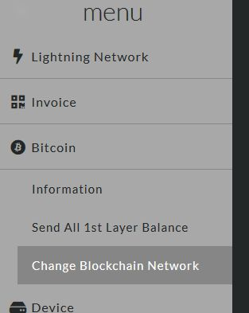
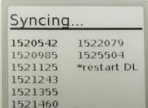

# [Index](index.html)> FAQ

## Lightning Shield / Raspberry Pi

* [How to use the panel buttons?](#how-to-use-the-panel-buttons)
* [AP mode?](#ap-mode)
* [CLIENT mode?](#client-mode)
* [What is the WEB setting password](#what-is-the-web-setting-password)
* [Fail to connect my WiFi network!](#fail-to-connect-my-wifi-network)
* [Can I stop web setting site?](#can-i-stop-web-setting-site)
* [Can I connect via SSH?](#can-i-connect-via-ssh)

## Lightning Network / Ptarmigan

* [How to switch mainnet/testnet?](#how-to-switch-mainnettestnet)
* [What Bitcoin feerate does Ptarmigan use?](#what-bitcoin-feerate-does-ptarmigan-use)
* [What is "failDL"?](#what-is-faildl)

----

## How to use panel buttons?

* push SW1 (5sec)
  - shutdown Rapsberry Pi
* push SW2 (5sec)
  - reboot and switch mode([AP](#ap-mode) / [CLIENT](#client-mode))
* push both SW (5sec)
  - remove SPV data and reboot
  - you might use it when it is abnormal

## What is an AP mode?

Raspberry Pi as a WiFi access point in a standalone network. For more information, please see [here](https://www.raspberrypi.org/documentation/configuration/wireless/access-point.md).

* SSID: `PtarmServer` / PASS: `Ptarmigan`
* IP address: `192.168.4.1`
  * Please disconnect all network other than Wi-Fi before you browse [http://192.168.4.1/](http://192.168.4.1/).
* WEB setting: enable
* Lightning Network: disable

## What is a CLIENT mode?

Raspberry Pi connects to user's WiFi router(home, office, ...).

* IP address: DHCP
  * URL: http://IP_ADDRESS/
* WEB setting: enable
* Lightning Network: enable

## What is the WEB setting password?

* default:
  * USER: `ptarm` / PASS: `ptarm`
* You can change the USER/PASS from WEB setting.

## Fail to connect my WiFi network!

SSID/Passphrase might not match.  There are two ways to deal with it.

* go to AP mode and set  
  [long press SW2](#how-to-use-the-buttons), after reboot [set SSID/PASS](setup_raspi.md#wifi-setting-and-reboot-client-mode).

* local login  
  You can connect mini-HDMI monitor and USB keyboard to Raspberry Pi Zero W.
  After the login, [set via command line](https://www.raspberrypi.org/documentation/configuration/wireless/wireless-cli.md).

## Can I stop web setting site?

Yes!  
Remove [RPI_USEWEB](control_file.md#rpi_useweb) file.

## Can I connect via SSH?

Yes!  
Released SD image is almost default RaspbianOS.

----

## How to switch mainnet/testnet?

## What Bitcoin feerate does Ptarmigan use?

Ptarmigan SPV mode uses the following feerate service.

* BlockCypher API
  * [mainnet](https://api.blockcypher.com/v1/btc/main)
  * [testnet](https://api.blockcypher.com/v1/btc/test3)
  * `medium_fee_per_kb`

## What is "failDL"?

Sometimes, startup syncing status shows "fail DL".  
   

It happens that SPV(bitcoinj) fails to download for more than one minute and restart Ptarmigan.  
In our experience, restarting Ptarmigan can fix it.
