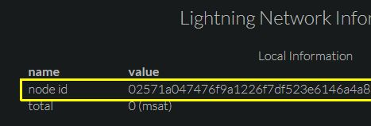
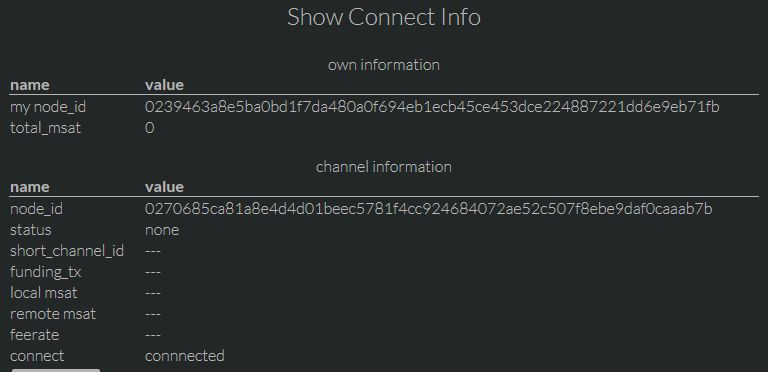
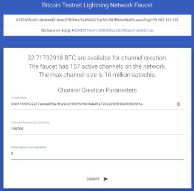
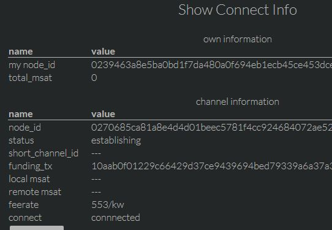
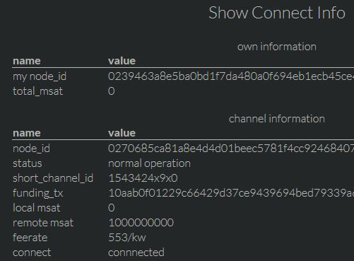

# [Index](index.html)> Lightning Network

Now all [CLIENT mode](setup_faq.md#client-mode) settings are done.  
Let's go to the next step - open channel.

* [Open channel from Testnet Faucet (Lightning Shield)](#open-channel-from-testnet-faucet-lightning-shield)
* [Open channel to Testnet Faucet (phone)](#open-channel-to-testnet-faucet-phone)

----

## Open channel from Testnet Faucet (Lightning Shield)

### 1. check my node_id

**menu: Channel > Show Connect Info**  

### 2. connect to other node that you want to open channel with

   Connect Raspberry Pi to peer node and open channel from the peer, because Raspberry Pi might not have a Global IP address.

   1. decide the peer node  
      You need decide the peer node. Your options are;
      * your node
      * faucet service  
        * Please use [Bitcoin Testnet Lightning Network Faucet](https://faucet.lightning.community/).

   2. connect to the peer node  
      Currently, Faucet node_id is `0270685ca81a8e4d4d01beec5781f4cc924684072ae52c507f8ebe9daf0caaab7b@159.203.125.125:9735` (please check the faucet site).  
      **menu: Connect/Close > Connect [NODE_ID@IPADDR:PORT]**  
      

   3. check the connection status: **connected**  
      **menu: Channel > Show Connect Info**  
      

### 3. open channel from the peer node

### 4. check the connection status: **establishing**

**menu: Channel > Show Connect Info**  

### 5. wait for some confirmation

You can [open channel from phone](#open-channel-to-testnet-faucet-phone) while waiting.

### 6. check the connection status: **normal operation**  

**menu: Channel > Show Connect Info**  

### 7. channel is opened

Finally, you can receive Bitcoin with Lightning Network.  
If receiving from hopped node, you will need more confirmation.

## Open channel to Testnet Faucet (phone)

Please use [Eclair Mobile Testnet](https://play.google.com/store/apps/details?id=fr.acinq.eclair.wallet).

### 1. setup Eclair Mobile Testnet

1. Install Eclair Mobile Testnet to your Android.
2. Receive Testnet amount

### 2. open channel to the Testnet Faucet

[Bitcoin Testnet Lightning Network Faucet](https://faucet.lightning.community/)  

### 3. wait for opening channel

wait above 6 confirmations

----

[Next> Payment test](setup_pay.md)
