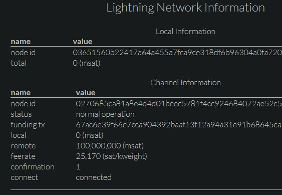

# [Index](index.html)> Lightning Network

Now, all [CLIENT mode](setup_faq.md#client-mode) settings are done.  
Let's go to the next step - open a channel.

* [Open a channel from Testnet Faucet (Lightning Shield)](#open-a-channel-from-testnet-faucet-lightning-shield)
* [Open a channel to Testnet Faucet (Phone)](#open-a-channel-to-testnet-faucet-Phone)

----

## Open channel from Testnet Faucet (Lightning Shield)  

### 1. Check my node_id

**Menu: Lightning Network > Information**  

### 2. Connect to other node that you want to open channel with

   Connect Raspberry Pi to peer node and open a channel from the peer, because Raspberry Pi might not have the Global IP address.

   1. Decide the peer node  
      You need decide the peer node. Your options are;
      * your node
      * faucet service  
        * Please use [Bitcoin Testnet Lightning Network Faucet](https://faucet.lightning.community/).

   2. Connect to the peer node  
      Currently(Oct.28,2020), Faucet node_id is `0270685ca81a8e4d4d01beec5781f4cc924684072ae52c507f8ebe9daf0caaab7b@159.203.125.125:9735` (please check the faucet site).  
      **Menu: Lightning Network > Connect Node**  
      

   3. Check the connection status: **connected**  
      **Menu: Lightning Network > Information**  
      

### 3. Open channel from the peer node

`Target Node`: Your Lightning Shield's node id("Menu: Lightning Network > Information >> Local Information:node id")

### 4. Check the connection status: **establishing**

**Menu: Lightning Network > Information**  

### 5. Wait for some confirmations

You can [open a channel from phone](#open-a-channel-to-testnet-faucet-phone) while waiting for.

### 6. Check the connection status: **normal operation**  

**Menu: Lightning Network > Information**  

### 7. Channel is opened

Finally, you can receive Bitcoin with Lightning Network.  
Receiving from hopped node, you will need more than 6 confirmations.

----

## Open channel to Testnet Faucet (phone)

### 1. Setup Lightning Testnet wallet

1. Install a Mobile Testnet to your phone.
2. Receive the Testnet amount.

### 2. Open channel to the Testnet Faucet

[Bitcoin Testnet Lightning Network Faucet](https://faucet.lightning.community/)  

Finally, you can send Bitcoin with Lightning Network!  

----

[Next> Payment test](setup_pay.md)

