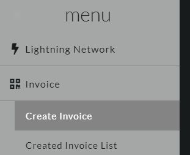

# [top](index.html)> Payment test

Let's making a Lightning payment!

* [Create an invoice](#create-an-invoice)
* [Payment](#payment)

----

## Create an invoice

1. Create an invoice from WEB setting.

  
  

2. Wait for displaying the QR code on the ePaper.

## The payment

1. Scan the QR code displayed the ePaper.
2. Payment!
3. Wait...
4. ePaper displays "Received!"

