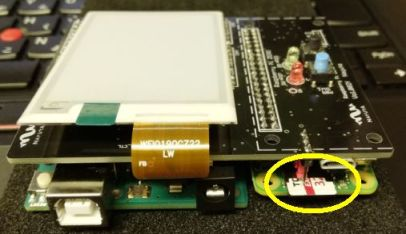
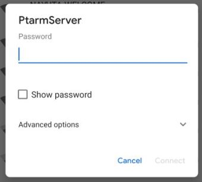
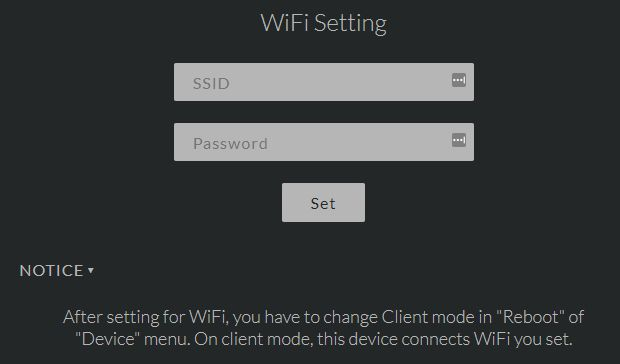
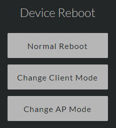
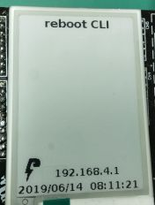
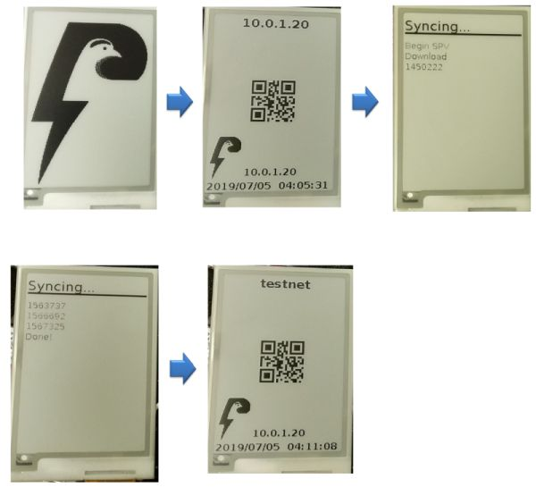

# [Index](index.html)> Raspberry Pi

* [SD card](#sd-card)
* [WiFi setting and reboot CLIENT mode](#wifi-setting-and-reboot-client-mode)

## SD card

RaspbianOS + Lightning Shield for Arduino modules

### 1. Download a SD image file

* (Download URL: under development!)

### 2. Write the image to the SD card

Please refere to [how to write a SD card image](https://www.raspberrypi.org/documentation/installation/installing-images/README.md)

### 3. Turn on the power

Before turning on the power, insert the SD card into the Raspberry Pi combined with the Lightning Shield.  

After that, supply power through USB/AC adapter/micro-B USB and turn on the power! Do not worry about the first boot, it takes about a few minutes to show the first display. 

The [first boot](https://youtu.be/kF_WI_qtKfI) video can help you!  

## WiFi setting and CLIENT mode

### 1. First, [AP mode](setup_faq.md#ap-mode) starts

### 2. Connect your phone/PC to Raspberry Pi via Wi-Fi

* SSID: `PtarmServer`
* Password: `Ptarmigan`

* If you see the following dialog, just tap "Yes".

### 3. Open Browser

* [http://192.168.4.1/](http://192.168.4.1/)
* Authentication
  * Username: `ptarm` / Password: `ptarm`

### 4. **Menu: WiFi Settings > WPA_Supplicant [SSID] [PASS]**  

### 5. Set WiFi SSID/PASS that you want to connect to (your home, office, ...)

* In the same way to connect your phone to WiFi

### 6. **Menu: WiFi Settings > Reboot with WiFi Client Mode**  

### 7. Raspberry Pi reboots with [CLIENT mode](setup_faq.md#client-mode)

### 8. CLIENT mode starts  

### 9. Done!

You can open URL displayed IP address.

* http://IP_ADDRESS/

## NOTE

* `Syncing...` shows block downloads.
  * It takes a lot of time and sometimes restarts.
* If ePaper displays "no IP addr", Raspberry Pi does not get IP address from DHCP server.  
  
  * It might be caused by the fail Wi-Fi setting.  
* If you want to change the mode from CLIENT to AP, press Shield's switch for more than 5 sec..  
  

----

[Next> Lightning Network](setup_ln.md)
